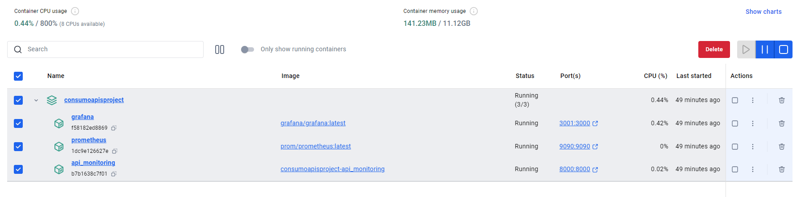

#  VALIDACIÓN DE APIS CON PYTHON

## ESTRUCTURA DE PROYECTO

| Directorio/Archivo         | Descripción                                                                 |
|----------------------------|-----------------------------------------------------------------------------|
| `Api_Groups/`              | Contiene archivos que definen listas de APIs para diferentes grupos.        |
| `apis_group1.py`           | Lista de APIs para el grupo 1.                                              |
| `apis_group2.py`           | Lista de APIs para el grupo 2.                                              |
| `apis_group3.py`           | Lista de APIs para el grupo 3.                                              |
| `ApiConsoleOutput.py`      | Script que valida las APIs y muestra los resultados en la consola.          |
| `ApiConsumo.py`            | Script principal que valida las APIs y expone métricas a través de Prometheus.|
| `config/`                  | Contiene archivos de configuración, como `alert_rules.yml`.                 |
| `docker-compose.yml`       | Archivo de configuración para Docker Compose.                               |
| `dockerfile`               | Archivo de configuración para construir una imagen Docker.                  |
| `Documentation.md`         | Archivo para la documentación del proyecto.                                 |
| `FlaskTest.code-workspace` | Archivo de configuración del espacio de trabajo de Visual Studio Code.      |
| `images/`                  | Directorio para almacenar imágenes.                                         |
| `kubernetes.yml`           | Archivo de configuración para Kubernetes.                                   |
| `prometheus.yml`           | Archivo de configuración para Prometheus.                                   |
| `requirements.txt`         | Archivo que lista las dependencias del proyecto.                            |

## EXPLICACIÓN DE ARCHIVOS PRINCIPALES

### Descripción de los Archivos Principales

#### `ApiConsumo.py`
Este archivo es el **núcleo del proyecto** y realiza las siguientes funciones:

- **Importa** las listas de APIs desde los archivos en `Api_Groups`.
- **Configura** las métricas de Prometheus (`REQUEST_TIME`, `REQUEST_STATUS`, `RESPONSE_TIME_BY_ENDPOINT`, `TOTAL_API_CALLS`).
- **Define** la función `validate_apis` que valida las APIs de cada grupo, mide el tiempo de respuesta y el estado de las solicitudes, y actualiza las métricas de Prometheus.
- **Inicia** un servidor HTTP en el puerto **8000** para exponer las métricas.
- **Ejecuta** la validación de las APIs en un bucle infinito, con un intervalo de **10 segundos**.

#### `ApiConsoleOutput.py`
Este archivo realiza una función similar a `ApiConsumo.py`, pero en lugar de exponer métricas a través de Prometheus, **muestra los resultados en la consola**:

- **Importa** las listas de APIs desde los archivos en `Api_Groups`.
- **Define** la función `validate_apis` que valida las APIs de cada grupo y maneja diferentes códigos de estado HTTP.
- **Define** la función `print_results` para imprimir los resultados de manera organizada.
- **Ejecuta** la validación de las APIs y muestra los resultados en la consola.


## Ejecución Manual del Proyecto

### 1. Creación de Entorno para Proyecto Python

En la carpeta donde inicie el proyecto, ejecute:

```bash
python -m venv Entorno
```

Luego se debe ejecutar el Entorno mediante `Activate`.

### 2. Instalación de Dependencias

Se ejecuta el comando para instalar todas las dependencias necesarias en el proyecto:

```bash
pip install requests prometheus_client colorama
```

### 3. Ejecutar Proyecto

Se inicia con el comando:

```bash
python ApiConsumo.py
```

###  4. Monitoreo con Prometheus

- Se debe iniciar Prometheus y previamente se debió haber añadido el puerto que se consume (8000) en el archivo `.yml`.

## Lista de Queries para Métricas de Servidor de APIs con Prometheus

### 1. Consulta del Último Código de Estado Reportado

Muestra el último código de estado y la hora en que fue reportado en cada API:

- `api_request_status`

### 2. Consulta el Tiempo que Tarda en Procesar Cada API

Muestra el tiempo que tardó la API en responder a la solicitud:

- `api_request_duration_seconds`

#  Integración y Ejecución con Docker & Docker Compose

### 1. Creación de Archivo "dockerfile"

Crear el archivo dockerfile con las especificaciones correspondientes al proyecto:

```dockerfile
# Usar una imagen base de Python
FROM python:3.12-slim

# Instalar dependencias
COPY requirements.txt requirements.txt
RUN pip install -r requirements.txt

# Copiar código de la aplicación
COPY . /app
WORKDIR /app

# Exponer el puerto en el que se ejecutará la aplicación
EXPOSE 8000

# Comando para iniciar la aplicación
CMD ["python", "ApiConsumo.py"]
```

### 2. Creación de Archivo "requirements.txt"

Se necesita crear el archivo ya que este contiene las dependencias necesarias para que el proyecto se pueda ejecutar:

```
requests
prometheus_client
certifi
urllib3
```

### 3. Creación de Archivo "docker-compose.yml"

Crear el archivo de Docker Compose, para poder ejecutar todos los contenedores en un mismo entorno:

```yaml
version: '3.8'
services:
  prometheus:
    image: prom/prometheus:latest
    container_name: prometheus
    ports:
      - "9090:9090"
    volumes:
      - ./prometheus.yml:/etc/prometheus/prometheus.yml
      - prometheus-data:/prometheus
    command:
      - '--config.file=/etc/prometheus/prometheus.yml'

  grafana:
    image: grafana/grafana:latest
    container_name: grafana
    ports:
      - "3001:3000"
    environment:
      - GF_SECURITY_ADMIN_PASSWORD=your_password
    volumes:
      - grafana-storage:/var/lib/grafana
  api_monitoring:
    build: .
    container_name: api_monitoring
    ports:
      - "8000:8000"
    depends_on:
      - prometheus
volumes:
  grafana-storage:
  prometheus-data:
```

### 4. Creación de Archivo "prometheus.yml"

Es necesario crear este archivo para poder mapear el puerto y la ruta que utilizará `prometheus` para monitorear:

```yaml
global: 
  scrape_interval: 15s 

scrape_configs: 
  - job_name: 'api_monitoring' 
    static_configs: 
      - targets: ['api_monitoring:8000']

  - job_name: 'prometheus' 
    static_configs: 
      - targets: ['prometheus:9090']
```

### 5. Creación de la Imagen del Proyecto con Docker (Opcional)

Luego de tener todos los archivos creados y entrelazados respectivamente, se ejecuta el siguiente comando para ejecutar el `dockerfile` y crear la imagen del proyecto:

*(Este comando crea una imagen individual para poder ejecutar el proyecto, el archivo docker-compose crea automáticamente la imagen sin necesidad de este punto.)*

- El comando debe ser ejecutado en la ruta donde se encuentra el archivo `dockerfile`:

```bash
docker build -t my-api-monitoring-project .
```

### 6. Construcción de Contenedores con Docker Compose (Obligatorio)

Ya al tener los archivos de Docker correctamente configurados, se puede ejecutar Docker Compose para crear los contenedores y la imagen automáticamente. Para iniciar la construcción se ejecuta el siguiente comando, y se debe ejecutar desde la raíz donde se encuentren todos los documentos:

```bash
docker-compose up --build  
```

*(Si la imagen ya está construida se puede saltar `--build`)*

### 7. Verificación de Ejecución

Al verificar en Docker, los servicios de las aplicaciones se están ejecutando en el grupo de contenedores `consumoapisproject`.



### 8. Solución de Problemas Comunes

#### Error: "ModuleNotFoundError: No module named 'requests'"

Este error indica que las dependencias no se han instalado correctamente. Asegúrate de haber ejecutado el comando:

```bash
pip install -r requirements.txt
```

#### Error: "Bind for 0.0.0.0:8000 failed: port is already allocated"

Este error ocurre cuando el puerto 8000 ya está en uso. Puedes detener el proceso que está utilizando el puerto o cambiar el puerto en el archivo `docker-compose.yml`.

#### Error: "prometheus: error while loading shared libraries"

Este error puede deberse a una configuración incorrecta del volumen en `docker-compose.yml`. Asegúrate de